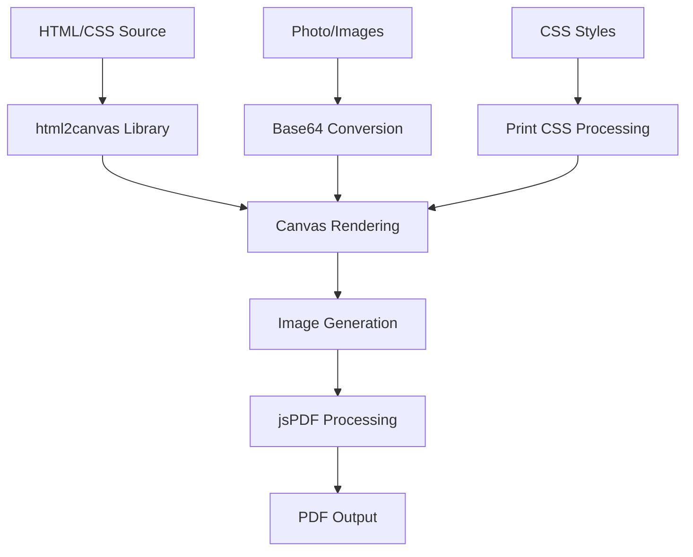

# 📄 PDF Generation Complete Guide - CV Website

## 📋 Table of Contents
1. [PDF Generation Overview](#pdf-generation-overview)
2. [Technical Architecture](#technical-architecture)
3. [CSS to PDF Mapping](#css-to-pdf-mapping)
4. [File Connections & Dependencies](#file-connections--dependencies)
5. [PDF Generation Formulas](#pdf-generation-formulas)
6. [Image & Photo Handling](#image--photo-handling)
7. [Print CSS Optimization](#print-css-optimization)
8. [ATS PDF Generation](#ats-pdf-generation)
9. [Troubleshooting Guide](#troubleshooting-guide)
10. [Performance Optimization](#performance-optimization)

---

## 📄 PDF Generation Overview

### 🔧 How PDF Generation Works

Our CV website uses a **multi-step process** to convert HTML/CSS to PDF:



### 🎯 Three PDF Generation Methods

1. **Standard PDF**: Direct HTML→Canvas→PDF conversion
2. **Print-Optimized PDF**: Browser's native print with CSS optimizations
3. **ATS-Optimized PDF**: Simplified layout for ATS scanners

---

## 🏗️ Technical Architecture

### 📁 File Structure for PDF Generation

```
src/
├── lib/
│   ├── pdf.ts                 # Main PDF generation logic
│   └── cvData.ts             # CV data structure
├── components/
│   └── cv/
│       └── CVLayout.tsx      # Main CV component to render
├── app/
│   ├── globals.css           # CSS styles + Print optimizations
│   └── page.tsx              # PDF download triggers
└── types/
    └── cv.ts                 # TypeScript interfaces
```

### 🔗 Key Dependencies

```json
{
  "html2canvas": "^1.4.1",     // HTML to Canvas conversion
  "jspdf": "^2.5.1",          // PDF generation from canvas
  "next/image": "15.3.5",     // Image optimization
  "tailwindcss": "^3.4.0"     // CSS framework
}
```

---

## 🎨 CSS to PDF Mapping

### 📐 **Dimension Conversions**

| CSS Unit | PDF Equivalent | Formula | Usage |
|----------|----------------|---------|-------|
| `px` | `pt` | `px * 0.75 = pt` | General sizing |
| `mm` | `pt` | `mm * 2.834 = pt` | Print dimensions |
| `in` | `pt` | `in * 72 = pt` | Document sizing |
| `%` | `calculated` | Based on parent | Responsive elements |

### 📏 **A4 Paper Dimensions**

```css
/* A4 Paper Size Constants */
.a4-dimensions {
  width: 210mm;    /* 595.28pt */
  height: 297mm;   /* 841.89pt */
  margin: 0.5in;   /* 36pt */
}
```

### 🎨 **CSS Properties → PDF Behavior**

#### **Background & Colors**
```css
/* ✅ PDF COMPATIBLE */
background-color: #ffffff;    /* Solid colors work */
color: #000000;              /* Text colors preserved */
border: 1pt solid #000000;   /* Borders maintained */

/* ❌ PDF PROBLEMATIC */
background: linear-gradient(...);  /* Gradients may not render */
box-shadow: 0 4px 8px rgba(...);  /* Shadows lost in PDF */
backdrop-filter: blur(10px);      /* Effects not supported */
```

#### **Typography**
```css
/* ✅ RECOMMENDED FOR PDF */
font-family: 'Arial', 'Helvetica', sans-serif;  /* Standard fonts */
font-size: 11pt;                                 /* Point sizes */
line-height: 1.4;                               /* Proper spacing */
font-weight: bold;                               /* Basic weights */

/* ❌ AVOID FOR PDF */
font-family: 'CustomFont', cursive;             /* Custom fonts */
text-shadow: 2px 2px 4px rgba(...);            /* Text effects */
```

#### **Layout & Positioning**
```css
/* ✅ PDF COMPATIBLE */
display: block;              /* Block layouts work best */
margin: 10pt;               /* Standard margins */
padding: 8pt;               /* Standard padding */
page-break-inside: avoid;   /* Prevents content splitting */

/* ❌ PDF PROBLEMATIC */
display: grid;              /* Complex layouts may break */
position: fixed;            /* Fixed positioning ignored */
transform: rotate(45deg);   /* Transformations lost */
```

---

## 🔗 File Connections & Dependencies

### 📄 **Main PDF Generation Flow**

#### 1. **Trigger Point** (`src/app/page.tsx`)
```typescript
const handleDownloadPDF = async () => {
  await PDFGenerator.generateFromElement('cv-container');
};
```

#### 2. **PDF Generator** (`src/lib/pdf.ts`)
```typescript
export class PDFGenerator {
  static async generateFromElement(elementId: string) {
    // 🔍 WHAT TO LOOK FOR:
    const element = document.getElementById(elementId);  // Gets CV container
    const clone = element.cloneNode(true);              // Creates copy
    this.applyPDFStyles(clone);                        // Applies PDF-specific CSS
    await this.prepareElementForPDF(clone);            // Converts images
    const canvas = await html2canvas(clone, options);   // Renders to canvas
    const pdf = new jsPDF('portrait', 'mm', 'a4');     // Creates PDF
    pdf.addImage(canvas.toDataURL(), 'PNG', ...);      // Adds image to PDF
  }
}
```

#### 3. **CV Layout** (`src/components/cv/CVLayout.tsx`)
```typescript
export default function CVLayout({ data }: CVLayoutProps) {
  return (
    <div 
      id="cv-container"                    // 🎯 TARGET FOR PDF GENERATION
      className="cv-container max-w-4xl"  // 🎨 CSS CLASSES APPLIED
    >
      {/* CV Content */}
    </div>
  );
}
```

#### 4. **CSS Styles** (`src/app/globals.css`)
```css
/* 🖥️ SCREEN STYLES */
.cv-container {
  font-family: Arial, sans-serif;
  background: white;
  color: black;
}

/* 🖨️ PRINT STYLES - APPLIED TO PDF */
@media print {
  .cv-container {
    font-size: 11pt !important;        /* ⚡ PDF FONT SIZE */
    line-height: 1.4 !important;       /* ⚡ PDF LINE HEIGHT */
    padding: 0.5in !important;         /* ⚡ PDF MARGINS */
    background: white !important;      /* ⚡ PDF BACKGROUND */
  }
}
```

---

## 🔢 PDF Generation Formulas

### 📐 **Dimension Calculations**

#### **A4 Paper Constants**
```typescript
const A4_DIMENSIONS = {
  WIDTH_MM: 210,        // A4 width in millimeters
  HEIGHT_MM: 297,       // A4 height in millimeters
  WIDTH_PT: 595.28,     // A4 width in points (210mm * 2.834)
  HEIGHT_PT: 841.89,    // A4 height in points (297mm * 2.834)
  DPI: 72               // Standard PDF DPI
};
```

#### **Canvas to PDF Scaling**
```typescript
// Formula: Scale canvas to fit A4 width
const imgWidth = 210;  // A4 width in mm
const imgHeight = (canvas.height * imgWidth) / canvas.width;

// Page calculation
const pageHeight = 295;  // A4 height in mm (minus margins)
let heightLeft = imgHeight;
let position = 0;

// Multi-page calculation
while (heightLeft >= 0) {
  position = heightLeft - imgHeight;
  pdf.addPage();
  pdf.addImage(canvas, 'PNG', 0, position, imgWidth, imgHeight);
  heightLeft -= pageHeight;
}
```

#### **Image Scaling Formula**
```typescript
// Maintain aspect ratio while fitting within bounds
function calculateImageSize(originalWidth: number, originalHeight: number, maxWidth: number, maxHeight: number) {
  const widthRatio = maxWidth / originalWidth;
  const heightRatio = maxHeight / originalHeight;
  const scale = Math.min(widthRatio, heightRatio);
  
  return {
    width: originalWidth * scale,
    height: originalHeight * scale,
    scale: scale
  };
}
```

### 🎯 **Photo Positioning Formulas**

#### **Professional Photo in Header**
```typescript
// Photo size calculation for PDF
const PHOTO_CONFIG = {
  MAX_WIDTH: 100,      // Maximum width in points
  MAX_HEIGHT: 100,     // Maximum height in points
  BORDER_WIDTH: 1,     // Border thickness
  MARGIN_RIGHT: 10,    // Space from text
  POSITION: 'top-right' // Header position
};

// Calculate photo position
function calculatePhotoPosition(pageWidth: number, pageHeight: number) {
  return {
    x: pageWidth - PHOTO_CONFIG.MAX_WIDTH - PHOTO_CONFIG.MARGIN_RIGHT,
    y: 20,  // Top margin
    width: PHOTO_CONFIG.MAX_WIDTH,
    height: PHOTO_CONFIG.MAX_HEIGHT
  };
}
```

---

## 🖼️ Image & Photo Handling

### 📸 **Photo Processing Pipeline**

#### **Step 1: Image Detection**
```typescript
// 🔍 WHAT TO LOOK FOR: Images in CV container
const images = element.querySelectorAll('img');
```

#### **Step 2: Base64 Conversion**
```typescript
private static async convertImageToBase64(imgElement: HTMLImageElement): Promise<string> {
  return new Promise((resolve, reject) => {
    const canvas = document.createElement('canvas');
    const ctx = canvas.getContext('2d');
    
    // Set canvas size to image size
    canvas.width = imgElement.naturalWidth || imgElement.width;
    canvas.height = imgElement.naturalHeight || imgElement.height;
    
    // Handle CORS and create new image
    const img = new Image();
    img.crossOrigin = 'anonymous';
    
    img.onload = () => {
      ctx.drawImage(img, 0, 0);
      resolve(canvas.toDataURL('image/png', 1.0));  // 🎯 HIGH QUALITY
    };
    
    // Handle different image sources
    if (imgElement.src.startsWith('/_next/')) {
      img.src = imgElement.src;  // Next.js optimized images
    } else {
      img.src = imgElement.src;  // Regular images
    }
  });
}
```

#### **Step 3: Image Embedding**
```typescript
// Replace original image source with base64
async prepareElementForPDF(element: HTMLElement): Promise<void> {
  const images = element.querySelectorAll('img');
  const promises = Array.from(images).map(async (img) => {
    try {
      const base64 = await this.convertImageToBase64(img);
      if (base64) {
        img.src = base64;  // 🔄 REPLACE WITH BASE64
      }
    } catch (error) {
      console.warn('Failed to convert image:', error);
    }
  });
  
  await Promise.all(promises);
}
```

### 🎨 **Photo CSS → PDF Mapping**

```css
/* 🖥️ SCREEN VERSION */
.photo-container {
  width: 128px;
  height: 128px;
  border-radius: 50%;           /* Circular on screen */
  border: 4px solid white;
  box-shadow: 0 4px 20px rgba(0,0,0,0.1);
}

/* 🖨️ PDF VERSION */
@media print {
  .photo-container {
    width: 80pt !important;      /* ⚡ CONVERTED TO POINTS */
    height: 80pt !important;     /* ⚡ CONVERTED TO POINTS */
    border-radius: 0 !important; /* ⚡ SQUARE FOR ATS */
    border: 1pt solid black !important;
    box-shadow: none !important; /* ⚡ REMOVED FOR PDF */
    float: right !important;     /* ⚡ POSITIONED FOR ATS */
  }
}
```

---

## 🖨️ Print CSS Optimization

### 📋 **Print CSS Strategy**

#### **1. Override Screen Styles**
```css
@media print {
  /* Force all elements to be print-friendly */
  * {
    -webkit-print-color-adjust: exact !important;  /* Preserve colors */
    color-adjust: exact !important;
    print-color-adjust: exact !important;
  }
}
```

#### **2. Layout Optimization**
```css
@media print {
  /* Optimize container for A4 */
  .cv-container {
    max-width: none !important;     /* Remove width constraints */
    width: 100% !important;         /* Full page width */
    margin: 0 !important;           /* Remove margins */
    padding: 0.5in !important;      /* Standard page margins */
    background: white !important;   /* Ensure white background */
    box-shadow: none !important;    /* Remove shadows */
    border-radius: 0 !important;    /* Remove rounded corners */
  }
}
```

#### **3. Typography Optimization**
```css
@media print {
  /* Optimize fonts for print */
  body {
    font-family: 'Arial', 'Helvetica', sans-serif !important;
    font-size: 11pt !important;      /* ⚡ PRINT POINT SIZE */
    line-height: 1.4 !important;     /* ⚡ READABLE LINE HEIGHT */
    color: black !important;         /* ⚡ HIGH CONTRAST */
  }
  
  h1 { font-size: 18pt !important; }  /* ⚡ HEADER SIZES */
  h2 { font-size: 14pt !important; }
  h3 { font-size: 12pt !important; }
}
```

### 🎯 **Critical Print CSS Rules**

#### **Page Breaks**
```css
@media print {
  /* Prevent awkward page breaks */
  .no-break {
    page-break-inside: avoid !important;
  }
  
  .page-break {
    page-break-before: always !important;
  }
  
  section {
    page-break-inside: avoid !important;
  }
}
```

#### **Hide Non-Essential Elements**
```css
@media print {
  /* Hide download buttons and navigation */
  .no-print {
    display: none !important;
  }
  
  /* Simplify complex layouts */
  .grid {
    display: block !important;
  }
  
  .flex {
    display: block !important;
  }
}
```

---

## 🤖 ATS PDF Generation

### 🎯 **ATS Optimization Strategy**

#### **1. Simplify Layout**
```typescript
private static optimizeForATS(element: HTMLElement): void {
  // Remove all background colors and gradients
  element.style.background = 'white';
  element.style.backgroundImage = 'none';
  
  // Simplify all child elements
  const allElements = element.querySelectorAll('*');
  allElements.forEach(el => {
    const htmlEl = el as HTMLElement;
    htmlEl.style.background = 'white';         // ⚡ WHITE BACKGROUND
    htmlEl.style.backgroundImage = 'none';     // ⚡ NO GRADIENTS
    htmlEl.style.boxShadow = 'none';          // ⚡ NO SHADOWS
    htmlEl.style.borderRadius = '0';          // ⚡ NO ROUNDED CORNERS
    htmlEl.style.color = 'black';             // ⚡ BLACK TEXT
    htmlEl.style.fontFamily = 'Arial, sans-serif'; // ⚡ STANDARD FONTS
  });
}
```

#### **2. Convert Grid to Linear**
```typescript
// Convert grid layouts to simple blocks for ATS
const gridElements = element.querySelectorAll('.grid');
gridElements.forEach(grid => {
  const htmlGrid = grid as HTMLElement;
  htmlGrid.style.display = 'block';          // ⚡ LINEAR LAYOUT
  htmlGrid.style.gridTemplateColumns = 'none'; // ⚡ REMOVE GRID
  htmlGrid.style.gap = '0';                   // ⚡ NO GAPS
});
```

#### **3. Optimize Photo for ATS**
```typescript
// Make photo ATS-friendly
const photoContainer = element.querySelector('.photo-container');
if (photoContainer) {
  const htmlContainer = photoContainer as HTMLElement;
  htmlContainer.style.width = '100px';       // ⚡ STANDARD SIZE
  htmlContainer.style.height = '100px';      // ⚡ SQUARE SHAPE
  htmlContainer.style.borderRadius = '0';    // ⚡ NO CIRCLE
  htmlContainer.style.border = '1px solid black'; // ⚡ CLEAR BORDER
  htmlContainer.style.float = 'right';       // ⚡ ATS POSITION
}
```

---

## 🛠️ Troubleshooting Guide

### ❌ **Common PDF Issues & Solutions**

#### **1. Photo Not Displaying in PDF**
```typescript
// ❌ PROBLEM: CORS issues with images
// ✅ SOLUTION: Convert to base64 before PDF generation

// Check if image loads properly
img.onload = () => {
  console.log('✅ Image loaded successfully');
  ctx.drawImage(img, 0, 0);
  resolve(canvas.toDataURL('image/png', 1.0));
};

img.onerror = () => {
  console.error('❌ Image failed to load');
  // Fallback: try different approach
};
```

#### **2. PDF Layout Broken**
```css
/* ❌ PROBLEM: Complex CSS not rendering */
/* ✅ SOLUTION: Simplify styles for PDF */

@media print {
  /* Remove complex layouts */
  .bg-gradient-to-r {
    background: #f8fafc !important;  /* Solid color fallback */
    background-image: none !important;
  }
  
  /* Simplify grids */
  .grid {
    display: block !important;
  }
}
```

#### **3. Text Too Small in PDF**
```css
/* ❌ PROBLEM: Pixel units too small for print */
/* ✅ SOLUTION: Use point units */

@media print {
  body {
    font-size: 11pt !important;    /* ⚡ READABLE SIZE */
    line-height: 1.4 !important;   /* ⚡ PROPER SPACING */
  }
}
```

#### **4. PDF File Too Large**
```typescript
// ❌ PROBLEM: High resolution creates large files
// ✅ SOLUTION: Optimize canvas settings

const canvas = await html2canvas(clone, {
  scale: 2,              // ⚡ BALANCE QUALITY/SIZE
  quality: 0.95,         // ⚡ SLIGHT COMPRESSION
  useCORS: true,         // ⚡ HANDLE IMAGES
  backgroundColor: '#ffffff' // ⚡ WHITE BACKGROUND
});
```

### 🔍 **Debugging PDF Generation**

#### **Debug Mode Setup**
```typescript
// Enable debug logging
const DEBUG_PDF = process.env.DEBUG_PDF === 'true';

if (DEBUG_PDF) {
  console.log('🔍 PDF Debug Info:');
  console.log('Canvas dimensions:', canvas.width, 'x', canvas.height);
  console.log('Image data size:', canvas.toDataURL().length);
  console.log('PDF pages:', Math.ceil(imgHeight / pageHeight));
}
```

#### **Image Debug Checklist**
```typescript
// Check image status before PDF generation
function debugImageStatus(element: HTMLElement) {
  const images = element.querySelectorAll('img');
  images.forEach((img, index) => {
    console.log(`🖼️ Image ${index}:`, {
      src: img.src,
      width: img.width,
      height: img.height,
      naturalWidth: img.naturalWidth,
      naturalHeight: img.naturalHeight,
      complete: img.complete,
      crossOrigin: img.crossOrigin
    });
  });
}
```

---

## ⚡ Performance Optimization

### 🚀 **Speed Optimizations**

#### **1. Canvas Optimization**
```typescript
const optimizedOptions = {
  scale: 2,                    // ⚡ BALANCE QUALITY/SPEED
  useCORS: true,              // ⚡ HANDLE CROSS-ORIGIN
  allowTaint: true,           // ⚡ ALLOW TAINTED CANVAS
  backgroundColor: '#ffffff', // ⚡ EXPLICIT BACKGROUND
  logging: false,             // ⚡ DISABLE DEBUG LOGS
  width: clone.scrollWidth,   // ⚡ EXACT DIMENSIONS
  height: clone.scrollHeight,
  scrollX: 0,                 // ⚡ NO SCROLL OFFSET
  scrollY: 0
};
```

#### **2. Async Processing**
```typescript
// Process images in parallel
const promises = Array.from(images).map(async (img) => {
  return this.convertImageToBase64(img);
});

await Promise.all(promises);  // ⚡ PARALLEL PROCESSING
```

#### **3. Memory Management**
```typescript
// Clean up after PDF generation
try {
  await this.generateFromElement('cv-ats-temp');
} finally {
  // ⚡ ALWAYS CLEAN UP
  document.body.removeChild(clone);
}
```

### 📊 **Quality vs Performance Settings**

| Setting | Fast | Balanced | High Quality |
|---------|------|----------|-------------|
| **Scale** | 1 | 2 | 3 |
| **Quality** | 0.8 | 0.95 | 1.0 |
| **File Size** | Small | Medium | Large |
| **Generation Time** | Fast | Medium | Slow |

---

## 🎯 **Quick Reference: Key Locations**

### 📁 **Where to Look for PDF Issues**

1. **PDF Generation Logic**: `src/lib/pdf.ts`
2. **CV Layout Component**: `src/components/cv/CVLayout.tsx`  
3. **Print CSS Styles**: `src/app/globals.css` (look for `@media print`)
4. **Download Buttons**: `src/app/page.tsx`
5. **Image Processing**: `convertImageToBase64()` function
6. **Style Application**: `applyPDFStyles()` function

### 🔧 **Key Functions to Monitor**

```typescript
// Main generation function
PDFGenerator.generateFromElement(elementId)

// Image processing  
convertImageToBase64(imgElement)

// Style optimization
applyPDFStyles(element)

// ATS optimization
optimizeForATS(element)
```

### 📐 **Important CSS Selectors**

```css
#cv-container          /* Main PDF target */
.photo-container       /* Professional photo */
.no-print             /* Hidden in PDF */
@media print          /* PDF-specific styles */
.cv-container         /* Main layout */
```

---

## ✅ **Conclusion**

This guide provides complete insight into how PDF generation works in the CV website. Key takeaways:

1. **HTML→Canvas→PDF** pipeline using html2canvas and jsPDF
2. **CSS mapping** from screen to print using @media print rules
3. **Image handling** through base64 conversion for CORS compliance
4. **ATS optimization** by simplifying layouts and removing decorative elements
5. **Performance tuning** through parallel processing and memory management

For specific issues, check the file locations mentioned above and use the debugging techniques provided.

---

**Last Updated**: January 10, 2025  
**Version**: 1.0.0  
**Related Files**: `src/lib/pdf.ts`, `src/app/globals.css`, `src/components/cv/CVLayout.tsx` 