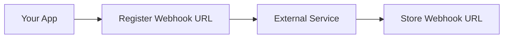
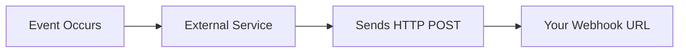
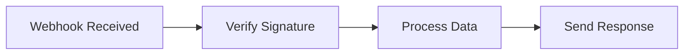
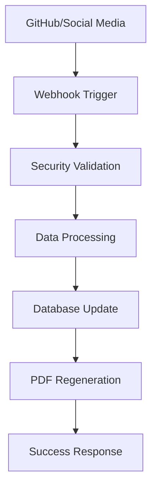

# 🔗 Webhook Documentation - CV Website

## 📋 Table of Contents
1. [What are Webhooks?](#what-are-webhooks)
2. [How Webhooks Work](#how-webhooks-work)
3. [CV Website Webhook System](#cv-website-webhook-system)
4. [Security Implementation](#security-implementation)
5. [API Endpoints](#api-endpoints)
6. [Usage Examples](#usage-examples)
7. [Testing Guide](#testing-guide)
8. [Error Handling](#error-handling)
9. [Best Practices](#best-practices)
10. [Troubleshooting](#troubleshooting)

---

## 🤔 What are Webhooks?

Webhooks are **HTTP callbacks** that allow applications to communicate with each other in real-time. Think of them as "reverse APIs" - instead of your application asking for data, the webhook sends data to your application automatically when something happens.

### 🔄 Traditional API vs Webhooks

**Traditional API (Pull Model):**
```
Your App → [REQUEST] → External Service
Your App ← [RESPONSE] ← External Service
```

**Webhooks (Push Model):**
```
External Service → [WEBHOOK] → Your App
External Service ← [RESPONSE] ← Your App
```

### 🎯 Why Use Webhooks?

- **Real-time Updates**: Get notified instantly when something changes
- **Efficient**: No need to constantly poll for updates
- **Automated**: Trigger actions automatically
- **Scalable**: Handle multiple events without manual intervention

---

## ⚙️ How Webhooks Work

### 1. **Setup Phase**


### 2. **Event Trigger**


### 3. **Processing**


---

## 🏗️ CV Website Webhook System

Our CV website uses webhooks to:
- **Update CV content** automatically
- **Sync GitHub repositories** 
- **Integrate social media** data
- **Trigger PDF regeneration**
- **Send notifications**

### 🔧 Architecture Overview



---

## 🔒 Security Implementation

### 🛡️ HMAC SHA-256 Signature Verification

Our webhook system uses **HMAC SHA-256** signatures for security:

```typescript
// Security validation process
const signature = request.headers['x-webhook-signature'];
const timestamp = request.headers['x-webhook-timestamp'];
const payload = request.body;

// Verify signature
const expectedSignature = crypto
  .createHmac('sha256', WEBHOOK_SECRET)
  .update(timestamp + payload)
  .digest('hex');

if (signature !== expectedSignature) {
  return new Response('Invalid signature', { status: 401 });
}
```

### 🔐 Security Features

- **HMAC SHA-256** signature verification
- **Timestamp validation** (prevents replay attacks)
- **Timing-safe comparison** (prevents timing attacks)
- **IP whitelisting** (optional)
- **Rate limiting** (10 requests per minute)
- **Admin authentication** required

---

## 🚀 API Endpoints

### 📍 Main Webhook Endpoint

```
POST /api/webhook/cv
```

**Headers Required:**
```json
{
  "Content-Type": "application/json",
  "X-Webhook-Signature": "sha256=<signature>",
  "X-Webhook-Timestamp": "<unix-timestamp>",
  "Authorization": "Bearer <admin-token>"
}
```

### 📋 Supported Operations

#### 1. **Update Personal Information**
```json
{
  "action": "update",
  "section": "personalInfo",
  "data": {
    "name": "Piotr Dankowiakowski",
    "title": "Senior 3D Artist & AI Specialist",
    "email": "piotr12451@gmail.com",
    "phone": "+48 505 286 064",
    "location": "Warsaw, Poland",
    "summary": "Professional summary here..."
  }
}
```

#### 2. **Add/Update Work Experience**
```json
{
  "action": "update",
  "section": "workExperience",
  "data": [{
    "id": "job-1",
    "position": "Senior 3D Artist",
    "company": "Freelance",
    "startDate": "2018",
    "endDate": "Present",
    "responsibilities": [
      "Create 3D models and animations",
      "Develop educational content"
    ],
    "achievements": [
      "Completed 150+ projects",
      "Generated $2.5M+ in approvals"
    ]
  }]
}
```

#### 3. **Update Skills**
```json
{
  "action": "update",
  "section": "skills",
  "data": [{
    "id": "3d-animation",
    "category": "3D Animation & Modeling",
    "skills": [
      {
        "name": "Blender",
        "level": "Expert",
        "years": 6
      },
      {
        "name": "Unreal Engine",
        "level": "Advanced",
        "years": 4
      }
    ]
  }]
}
```

#### 4. **Add Projects**
```json
{
  "action": "add",
  "section": "projects",
  "data": {
    "id": "new-project",
    "name": "AI Avatar System",
    "description": "Interactive AI-powered avatars",
    "startDate": "2023-01",
    "endDate": "2023-12",
    "technologies": ["ConvAI", "Blender", "Python"],
    "achievements": [
      "Developed 12 interactive avatars",
      "Improved response time by 45%"
    ]
  }
}
```

#### 5. **Sync GitHub Repositories**
```json
{
  "action": "sync",
  "section": "github",
  "data": {
    "username": "mrdanon",
    "repositories": ["SlotMachine", "portfolio3.0", "just_cv"]
  }
}
```

#### 6. **Update Social Media**
```json
{
  "action": "update",
  "section": "socialMedia",
  "data": {
    "youtube": {
      "handle": "@dr.blender",
      "subscribers": 25000,
      "videos": 150
    },
    "instagram": {
      "handle": "@doctor.blender",
      "followers": 12000,
      "posts": 200
    }
  }
}
```

---

## 💡 Usage Examples

### 🔧 Example 1: Update CV via curl

```bash
#!/bin/bash

# Configuration
WEBHOOK_URL="https://your-domain.com/api/webhook/cv"
WEBHOOK_SECRET="your-webhook-secret"
TIMESTAMP=$(date +%s)

# Prepare payload
PAYLOAD='{
  "action": "update",
  "section": "personalInfo",
  "data": {
    "name": "Piotr Dankowiakowski",
    "title": "Senior AI Specialist & 3D Artist"
  }
}'

# Generate signature
SIGNATURE=$(echo -n "${TIMESTAMP}${PAYLOAD}" | openssl dgst -sha256 -hmac "${WEBHOOK_SECRET}" -binary | base64)

# Send webhook
curl -X POST "${WEBHOOK_URL}" \
  -H "Content-Type: application/json" \
  -H "X-Webhook-Signature: sha256=${SIGNATURE}" \
  -H "X-Webhook-Timestamp: ${TIMESTAMP}" \
  -H "Authorization: Bearer ${ADMIN_TOKEN}" \
  -d "${PAYLOAD}"
```

### 🐍 Example 2: Python Script

```python
import requests
import json
import time
import hmac
import hashlib
import base64

class CVWebhookClient:
    def __init__(self, webhook_url, webhook_secret, admin_token):
        self.webhook_url = webhook_url
        self.webhook_secret = webhook_secret
        self.admin_token = admin_token
    
    def generate_signature(self, payload, timestamp):
        """Generate HMAC SHA-256 signature"""
        message = f"{timestamp}{payload}"
        signature = hmac.new(
            self.webhook_secret.encode(),
            message.encode(),
            hashlib.sha256
        ).digest()
        return base64.b64encode(signature).decode()
    
    def send_webhook(self, data):
        """Send webhook with proper authentication"""
        payload = json.dumps(data)
        timestamp = str(int(time.time()))
        signature = self.generate_signature(payload, timestamp)
        
        headers = {
            'Content-Type': 'application/json',
            'X-Webhook-Signature': f'sha256={signature}',
            'X-Webhook-Timestamp': timestamp,
            'Authorization': f'Bearer {self.admin_token}'
        }
        
        response = requests.post(
            self.webhook_url,
            headers=headers,
            data=payload
        )
        
        return response

# Usage
client = CVWebhookClient(
    webhook_url="https://your-domain.com/api/webhook/cv",
    webhook_secret="your-webhook-secret",
    admin_token="your-admin-token"
)

# Update work experience
response = client.send_webhook({
    "action": "update",
    "section": "workExperience",
    "data": [{
        "id": "freelance-2024",
        "position": "Senior 3D Artist & AI Specialist",
        "company": "Freelance",
        "startDate": "2018",
        "endDate": "Present",
        "responsibilities": [
            "Create photorealistic 3D visualizations",
            "Develop AI-powered educational avatars"
        ],
        "achievements": [
            "Completed 150+ complex projects",
            "Generated $2.5M+ in client approvals"
        ]
    }]
})

print(f"Status: {response.status_code}")
print(f"Response: {response.text}")
```

### 🌐 Example 3: JavaScript/Node.js

```javascript
const crypto = require('crypto');
const axios = require('axios');

class CVWebhookClient {
    constructor(webhookUrl, webhookSecret, adminToken) {
        this.webhookUrl = webhookUrl;
        this.webhookSecret = webhookSecret;
        this.adminToken = adminToken;
    }

    generateSignature(payload, timestamp) {
        const message = `${timestamp}${payload}`;
        const signature = crypto
            .createHmac('sha256', this.webhookSecret)
            .update(message)
            .digest('hex');
        return `sha256=${signature}`;
    }

    async sendWebhook(data) {
        const payload = JSON.stringify(data);
        const timestamp = Math.floor(Date.now() / 1000).toString();
        const signature = this.generateSignature(payload, timestamp);

        const headers = {
            'Content-Type': 'application/json',
            'X-Webhook-Signature': signature,
            'X-Webhook-Timestamp': timestamp,
            'Authorization': `Bearer ${this.adminToken}`
        };

        try {
            const response = await axios.post(this.webhookUrl, data, { headers });
            return response.data;
        } catch (error) {
            console.error('Webhook error:', error.response?.data || error.message);
            throw error;
        }
    }
}

// Usage
const client = new CVWebhookClient(
    'https://your-domain.com/api/webhook/cv',
    'your-webhook-secret',
    'your-admin-token'
);

// Add new project
client.sendWebhook({
    action: 'add',
    section: 'projects',
    data: {
        id: 'ai-avatar-system',
        name: 'AI Avatar System',
        description: 'Interactive AI-powered educational avatars',
        startDate: '2023-01',
        endDate: '2023-12',
        technologies: ['ConvAI', 'Blender', 'Python', 'Machine Learning'],
        achievements: [
            'Developed 12 interactive AI avatars',
            'Improved response time by 45%',
            'Deployed across 5 educational platforms'
        ]
    }
}).then(result => {
    console.log('Webhook sent successfully:', result);
}).catch(error => {
    console.error('Failed to send webhook:', error);
});
```

---

## 🧪 Testing Guide

### 1. **Local Testing Setup**

```bash
# Start development server
npm run dev

# Test webhook endpoint
curl -X POST http://localhost:3000/api/webhook/cv \
  -H "Content-Type: application/json" \
  -H "X-Webhook-Signature: sha256=test-signature" \
  -H "X-Webhook-Timestamp: $(date +%s)" \
  -d '{"action": "test", "section": "health"}'
```

### 2. **Webhook Testing Tools**

- **Postman**: Create webhook collections
- **ngrok**: Expose local server for testing
- **Webhook.site**: Test webhook delivery
- **Insomnia**: API testing and debugging

### 3. **Production Testing**

```bash
# Test production webhook
curl -X POST https://your-domain.com/api/webhook/cv \
  -H "Content-Type: application/json" \
  -H "X-Webhook-Signature: sha256=${SIGNATURE}" \
  -H "X-Webhook-Timestamp: ${TIMESTAMP}" \
  -H "Authorization: Bearer ${ADMIN_TOKEN}" \
  -d "${PAYLOAD}"
```

---

## ⚠️ Error Handling

### 📊 HTTP Status Codes

| Status Code | Description | Action |
|-------------|-------------|---------|
| `200` | Success | Webhook processed successfully |
| `400` | Bad Request | Invalid payload or missing data |
| `401` | Unauthorized | Invalid signature or missing auth |
| `422` | Unprocessable Entity | Data validation failed |
| `429` | Too Many Requests | Rate limit exceeded |
| `500` | Internal Server Error | Server error occurred |

### 🔧 Error Response Format

```json
{
  "error": "Invalid signature",
  "code": "INVALID_SIGNATURE",
  "timestamp": "2025-01-10T15:30:00Z",
  "details": {
    "expected": "sha256=expected-signature",
    "received": "sha256=received-signature"
  }
}
```

### 🔄 Retry Logic

```python
import time
import requests
from requests.adapters import HTTPAdapter
from urllib3.util.retry import Retry

def create_retry_session():
    session = requests.Session()
    retry_strategy = Retry(
        total=3,
        backoff_factor=1,
        status_forcelist=[429, 500, 502, 503, 504],
    )
    adapter = HTTPAdapter(max_retries=retry_strategy)
    session.mount("http://", adapter)
    session.mount("https://", adapter)
    return session

# Usage
session = create_retry_session()
response = session.post(webhook_url, json=data, headers=headers)
```

---

## 🎯 Best Practices

### 🔒 Security Best Practices

1. **Always verify signatures**
```python
if not verify_signature(signature, payload, secret):
    return Response('Invalid signature', status=401)
```

2. **Use HTTPS in production**
```
https://your-domain.com/api/webhook/cv
```

3. **Implement rate limiting**
```python
@ratelimit(key="ip", rate="10/m", method="POST")
def webhook_handler(request):
    # Process webhook
    pass
```

4. **Validate timestamps**
```python
current_time = time.time()
if abs(current_time - webhook_timestamp) > 300:  # 5 minutes
    return Response('Timestamp too old', status=401)
```

### 📊 Performance Best Practices

1. **Process webhooks asynchronously**
```python
import asyncio

async def process_webhook(data):
    # Process in background
    await update_database(data)
    await regenerate_pdf()
    await send_notification()
```

2. **Use database transactions**
```python
with transaction.atomic():
    update_personal_info(data)
    update_work_experience(data)
    log_webhook_event(data)
```

3. **Implement webhook queues**
```python
# Using Redis/Celery for queue management
from celery import Celery

app = Celery('webhook_processor')

@app.task
def process_webhook_task(webhook_data):
    # Process webhook in background
    pass
```

### 🎯 Data Management

1. **Validate all input data**
```python
from pydantic import BaseModel

class WebhookData(BaseModel):
    action: str
    section: str
    data: dict
    
    def validate_action(cls, v):
        if v not in ['update', 'add', 'delete', 'sync']:
            raise ValueError('Invalid action')
        return v
```

2. **Use database migrations**
```python
# Always backup before updates
def backup_cv_data():
    # Create backup
    pass

def update_cv_data(new_data):
    backup_cv_data()
    # Apply updates
    pass
```

---

## 🛠️ Troubleshooting

### 🔍 Common Issues

#### 1. **Invalid Signature Error**
```
Error: Invalid signature
```
**Solution:**
- Check webhook secret matches
- Verify signature generation algorithm
- Ensure timestamp is included in signature

#### 2. **Timestamp Too Old**
```
Error: Timestamp too old
```
**Solution:**
- Ensure system clocks are synchronized
- Generate timestamp just before sending
- Check network latency

#### 3. **Rate Limit Exceeded**
```
Error: Too Many Requests
```
**Solution:**
- Implement exponential backoff
- Reduce webhook frequency
- Contact admin for rate limit increase

#### 4. **Data Validation Failed**
```
Error: Invalid data format
```
**Solution:**
- Check JSON schema
- Validate required fields
- Ensure data types match

### 🔧 Debug Mode

Enable debug mode for detailed logging:

```bash
# Environment variable
DEBUG_WEBHOOKS=true npm run dev
```

Debug output example:
```
[WEBHOOK DEBUG] Received webhook:
  - Signature: sha256=abc123...
  - Timestamp: 1641834600
  - Action: update
  - Section: personalInfo
  - Data: { name: "...", title: "..." }
  
[WEBHOOK DEBUG] Signature verification:
  - Expected: sha256=abc123...
  - Received: sha256=abc123...
  - Status: ✅ Valid
  
[WEBHOOK DEBUG] Processing result:
  - Database updated: ✅
  - PDF regenerated: ✅
  - Response sent: ✅
```

---

## 🌟 Advanced Features

### 🔄 Webhook Replay

Replay failed webhooks:
```python
def replay_webhook(webhook_id):
    """Replay a failed webhook"""
    webhook = get_webhook_by_id(webhook_id)
    if webhook.status == 'failed':
        result = process_webhook(webhook.data)
        webhook.status = 'completed' if result else 'failed'
        webhook.save()
```

### 📊 Webhook Analytics

Track webhook performance:
```python
class WebhookAnalytics:
    def track_webhook(self, action, section, processing_time):
        analytics.record({
            'action': action,
            'section': section,
            'processing_time': processing_time,
            'timestamp': time.time()
        })
    
    def get_webhook_stats(self):
        return {
            'total_webhooks': self.count_total(),
            'success_rate': self.calculate_success_rate(),
            'avg_processing_time': self.avg_processing_time()
        }
```

### 🔐 Webhook Authentication

Multiple authentication methods:
```python
def authenticate_webhook(request):
    # Method 1: HMAC signature
    if verify_hmac_signature(request):
        return True
    
    # Method 2: API key
    if verify_api_key(request):
        return True
    
    # Method 3: JWT token
    if verify_jwt_token(request):
        return True
    
    return False
```

---

## 📚 Resources

### 📖 Additional Reading
- [Webhook Security Best Practices](https://webhooks.fyi/security)
- [HMAC Authentication Guide](https://tools.ietf.org/html/rfc2104)
- [RESTful API Design](https://restfulapi.net/)

### 🛠️ Tools & Libraries
- **Python**: `requests`, `hmac`, `hashlib`
- **Node.js**: `crypto`, `axios`, `express`
- **Testing**: `ngrok`, `postman`, `curl`
- **Monitoring**: `sentry`, `datadog`, `newrelic`

---

## ✅ Conclusion

Webhooks provide a powerful way to keep your CV website updated in real-time. With proper security implementation, error handling, and best practices, you can create a robust system that automatically syncs your professional information across platforms.

**Key Takeaways:**
- Always verify webhook signatures for security
- Implement proper error handling and retry logic
- Use rate limiting to prevent abuse
- Test thoroughly in both development and production
- Monitor webhook performance and success rates

For questions or support, please refer to the main project documentation or contact the development team.

---

**Last Updated:** January 10, 2025  
**Version:** 1.0.0  
**Author:** CV Website Development Team 